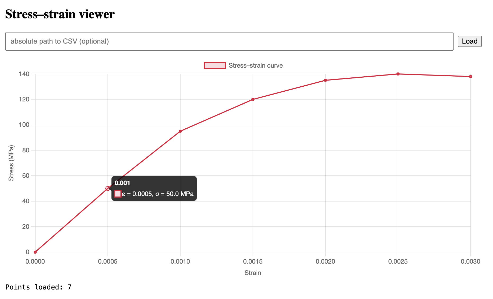

# Plot Vis

Simple stress–strain visualization tool built to demonstrate rapid adoption of C#, .NET, and Angular in an engineering workflow.



## Overview
- **Backend**: C# / .NET 8 Web API that reads CSV files containing stress–strain data
- **Frontend**: Angular + Chart.js for interactive plotting with engineering-friendly labels and tooltips
- Designed for quick proof-of-concept to showcase new tech learning
- Could be extended to WPF desktop app using same API

## How to Run
1. Clone the repo
2. Install dependencies for the frontend:
   ```bash
   cd web/plotvis-web
   npm install
   ```
3. Run the app
    ```bash
    ./run.sh
    ```
4. Click the local link shown in terminal.
